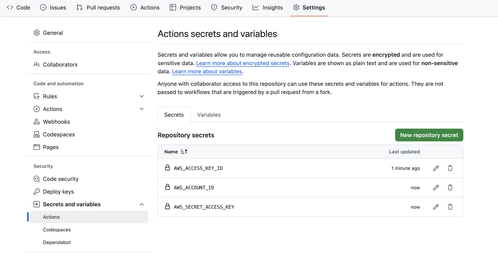
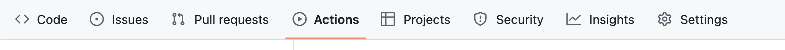

# Exercise 6: Create GitHub Actions workflow for the Todos.Api project

In this exercise, you will create a GitHub Actions workflow for the Todos.Api project. The workflow will contain steps to build and test the project. You will also add a step to publish the Docker image to AWS ECR after a successful build.

## Pre-requisites

- [GitHub account](https://github.com/signup)
- [AWS account](https://aws.amazon.com/)
- [Docker](https://docs.docker.com/get-docker/)

## Instructions

1. Create your own repository on GitHub.
2. Set AWS credentials as secrets in the repository settings:



3. Clone the repository to your local machine:

```bash
git clone {{YOUR_REPOSITORY_URL}}
```

4. Navigate to the cloned directory

5. Copy the `Todos.Api` project to the cloned directory

6. Create a multi-stage Dockerfile for the `Todos.Api` project:

```Dockerfile
# Dockerfile

# Build stage
# https://hub.docker.com/_/microsoft-dotnet
FROM mcr.microsoft.com/dotnet/sdk:9.0 AS build
WORKDIR /source

# copy csproj and restore as distinct layers
COPY *.csproj .
RUN dotnet restore

# copy everything else and build app
COPY . .
RUN dotnet publish -c Release -o /app --no-restore

# final stage/image
FROM mcr.microsoft.com/dotnet/aspnet:9.0
WORKDIR /app
COPY --from=build /app ./
CMD ["dotnet", "Todos.Api.dll"]
```

7. Create a new file called `.github/workflows/docker.yml` in the root of the new repository.

8. Open the `docker.yml` in a text editor and add the following content:

```yaml
name: Build and Push Docker image

on:
  push:
    branches:
      - main

env:
  AWS_ACCOUNT_ID: ${{ secrets.AWS_ACCOUNT_ID }}

jobs:
  build-and-push:
    runs-on: ubuntu-latest

    steps:
      # Step 1: Checkout the repository
      - name: Checkout code
        uses: actions/checkout@v3

      # Step 2: Configure AWS credentials
      - name: Configure AWS credentials
        uses: aws-actions/configure-aws-credentials@v3
        with:
          aws-access-key-id: ${{ secrets.AWS_ACCESS_KEY_ID }}
          aws-secret-access-key: ${{ secrets.AWS_SECRET_ACCESS_KEY }}
          aws-region: eu-central-1

      # Step 3: Authenticate to AWS ECR
      - name: Log in to Amazon ECR
        id: login-ecr
        uses: aws-actions/amazon-ecr-login@v2

      # Step 4: Build Docker image using multi-stage Dockerfile
      - name: Build Docker image
        working-directory: ./Todos.Api
        run: |
          docker build -t todos-api .

      - name: Tag Docker image
        run: |
          docker tag todos-api:latest ${{ env.AWS_ACCOUNT_ID }}.dkr.ecr.eu-central-1.amazonaws.com/todos-api:latest
          docker tag todos-api:latest ${{ env.AWS_ACCOUNT_ID }}.dkr.ecr.eu-central-1.amazonaws.com/todos-api:${{ github.sha }}

      # Step 5: Push Docker image to AWS ECR
      - name: Push Docker image
        run: |
          docker push ${{ env.AWS_ACCOUNT_ID }}.dkr.ecr.eu-central-1.amazonaws.com/todos-api:latest
          docker push ${{ env.AWS_ACCOUNT_ID }}.dkr.ecr.eu-central-1.amazonaws.com/todos-api:${{ github.sha }}
```

9. Save the file and close the text editor.

Make sure your new repository has the following structure:

```plaintext
.
├── Todos.Api
│   ├── Todos.Api.csproj
│   ├── Dockerfile
└── .github
    └── workflows
        └── docker.yml
```

10. Commit the changes to the repository:

```bash
git add .
git commit -m "Add GitHub Actions workflow"
git push
```

11. Navigate to the repository on GitHub and click on the "Actions" tab to view the workflow execution:



12. Verify that the workflow has been executed successfully.

13. Go to aws console and navigate to ECR service to see the pushed image. Inspect image tags.

Optional

- Make a change to the `Todos.Api` project and push the changes to the repository to see the workflow in action.
- Run the latest version from AWS ECR.

> [!NOTE]
> To update latest image tag, you can use the following command:

```bash
docker pull {{YOUR_ACCOUNT_ID}}.dkr.ecr.eu-central-1.amazonaws.com/todos-api:latest
```

- What is the point of tagging images with latest and git sha?

## Summary

Congratulations! You have successfully created a GitHub Actions workflow for the Todos.Api project. The workflow builds and tests the project and publishes the Docker image to AWS ECR after a successful build.
